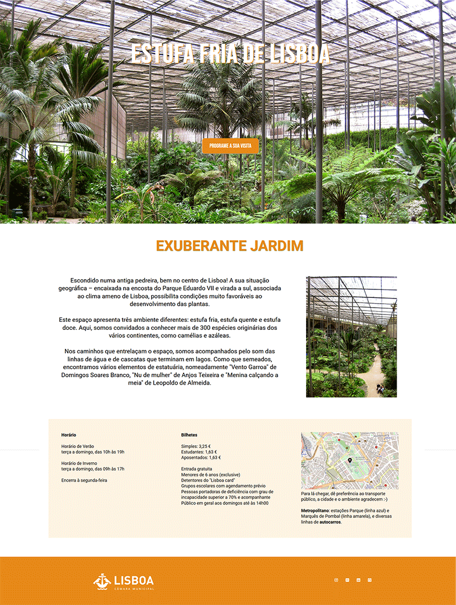
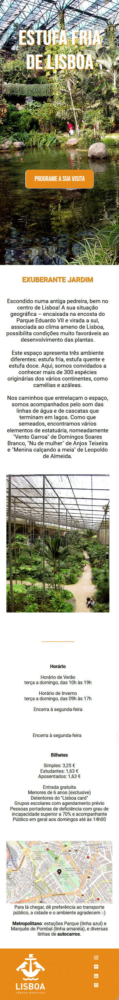

# Project Name
> landing page Estufa Fria de Lisboa

## Table of contents
* [General info](#general-info)
* [Screenshots](#screenshots)
* [Technologies](#technologies)
* [Status](#status)
* [Inspiration](#inspiration)
* [Contact](#contact)

## General info
This is the landing page of Estufa Fria de Lisboa. I thought about the design (including the photos) and developed the code for the page to be responsive using html and css, as an activity of the first stage of the StepByTech event held by LeWagon and Lisbon City Council, April 2023.

## Screenshots

## Technologies
* HTML - 5
* CSS - 3

## Status
The landing page presented here is the result of an exercise carried out at the end of the first stage of the StepByTech event in April 2023.

## Inspiration
In the first two weeks of the event StepByTech | Code Your Future by LeWagon and the Lisbon City Council were presented, mainly and brilliantly by teacher Mariana Macelino, the concepts for the realization of a landing page using html and css.
As an application of these concepts received, I applied in the realization of a landing page of Estufa Fria de Lisboa, one of my favorite places among so many attractions in this beautiful city, and I believe relatively little known.
The idea was to have a clear proposal, modern design and a call-to-action button, to be a responsive page, that is, to be well visible in several screens (such as mobile phone, tablet, notebook), to use some online libraries for fonts, icons and animation (such as googlefonts and fontawesome, for example), and to use html and css in its code. 

## Contact
Created by [@stankuns](https://www.fernando.arq.br/) - feel free to contact me!

#internet #website #frontend #html #css #landingpage #lewagon #lisbon #lisboa #cml #estufafria